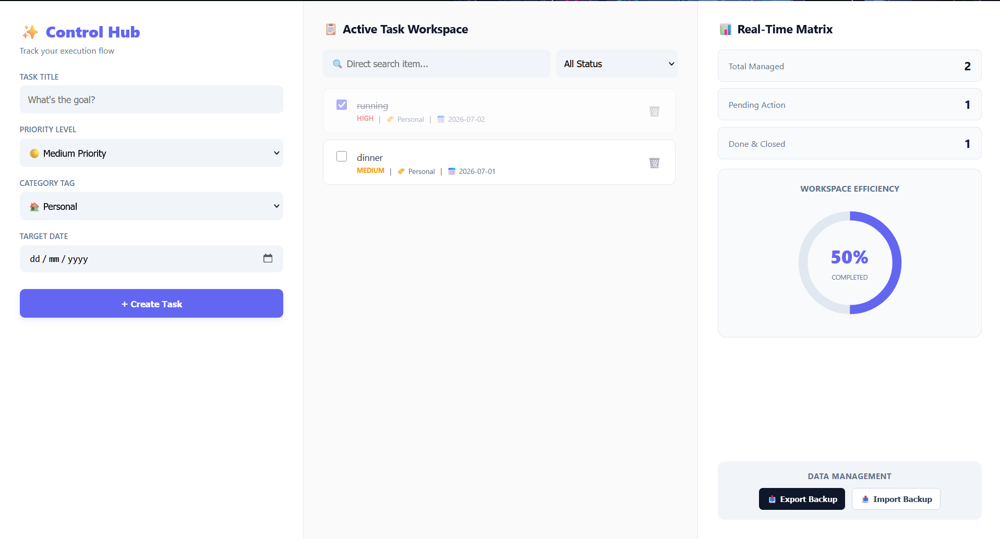

# ⚡ Premium To-Do Workspace Dashboard

A modern, minimal, and premium 3-column task management workspace engineered completely with native HTML5, CSS3, and Vanilla JavaScript. Zero external databases, zero API dependencies—fully powered by your web browser.

---

## 📸 Dashboard Preview

Here is a visual overview of the modern 3-column interface in action:

---

## 🔥 Workspace Zones (3-Column Interface)

The interface is structured into three clean, dedicated columns to manage your entire productivity flow on a single screen without vertical scrolling:

### 1. Control Hub (Left Panel)
* **Task Input:** Rapid input fields to capture new objectives seamlessly.
* **Priority Metrics:** Categorize targets into color-coded Low, Medium, or High markers.
* **Category Tagging:** Organize workflows under Personal 🏠, Work 💼, or Shopping 🛒.
* **Target Date:** Integrated calendar picker to define strict completion deadlines.

### 2. Active Task Workspace (Center Panel)
* **Live Feed:** Tasks update instantly inside a neat scrollable container upon submission.
* **Dynamic Search:** Real-time character filtering to track specific items immediately.
* **Status Switcher:** Quick filter to segment viewports between All, In Progress, or Completed states.
* **Lifecycle Actions:** Direct interactive checkboxes for completion toggles and click-to-delete modifiers.

### 3. Real-Time Matrix (Right Panel)
* **Live Statistics:** Clean data pills tracking Total Managed, Pending Action, and Done & Closed metrics.
* **Efficiency Graph:** A beautiful, responsive SVG circular chart animated dynamically based on your real-time completion percentage.
* **Data Management:** Built-in **Export Backup** and **Import Backup** system to save your task history locally in a structured JSON format.

---

## 🛠️ Built With

Meticulously crafted using pure client-side web technology stacks:

---

## 🔒 Storage & Privacy

* **Local Persistence:** Since this system functions entirely without an external database, your records are saved locally inside the browser's native **`localStorage`**.
* **100% Privacy:** Your data never leaves your device. It remains completely secure, private, and offline.
* *Note:* Clearing your browser cookies or cache will wipe the active storage. Use the integrated **Export Backup** feature on the right panel to secure an offline fallback file at any time.